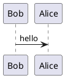

# CS Fundamentals

Computer Science (CS) is collection about data structure and algorithms with easy lessons by C++ at university.

Objective -

- To understand how to structure data in appropriate ways. Moreover, learning some algorithms in C++ to virtualize data and optimize as best as.

Please refer to documentation here - https://www.geeksforgeeks.org/

## Technical Overview


## Local machine setup

### Pre-requisites

### Initial config

Add the following commands on your bash file such as `.zshrc`, `.bashrc`.
```
cBuild() {
 DIR="$( cd "$( dirname "${BASH_SOURCE[0]}" )" &> /dev/null && pwd )"
 DIR_OUTPUT="$DIR/bin"

 if [ ! -d $DIR_OUTPUT ]; then
   mkdir -p $DIR_OUTPUT;
 fi

 clang++ -std=c++17 -stdlib=libc++ -g "$DIR/$1.cpp" -o "$DIR_OUTPUT/$1" && "$DIR_OUTPUT/$1";
}
```

### Common Tasks

Start local

`cBuild $nameFile`

## Documentation

You can add a README.md file to child directories as a documentation.

### UML Diagrams

We're using [plantuml](https://plantuml.com/) to draw UML diagrams.
Currently, Github does not support this syntax. However, we can easily view the diagrams in the text editors/IDE via the [plugins/extensions](https://plantuml.com/running)

- [Visual Studio Code Plugin](https://marketplace.visualstudio.com/items?itemName=jebbs.plantuml)
- [Atom](https://atom.io/packages/plantuml)
- [Vim](https://github.com/iamcco/markdown-preview.nvim)
- etc

````md
Add the diagram to a markdown file (.md)


````

It will render the diagram as below:


## References

1. Hassan, Fiyaz. “UML Made Easy with PlantUML & VS Code.” ContentLab, 1 Mar. 2019, https://contentlab.io/uml-made-easy-with-plantuml-vs-code/.
1. Cabot, Jordi. “A Coffee with Arnaud Roques (Creator of PlantUML).” Modeling Languages, 6 Sept. 2016, https://modeling-languages.com/interview-plantuml/.
